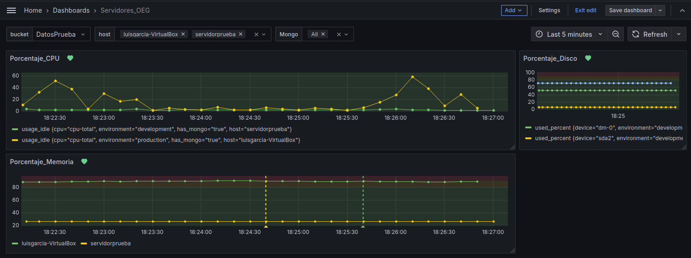
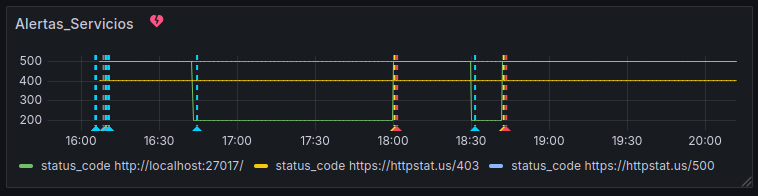
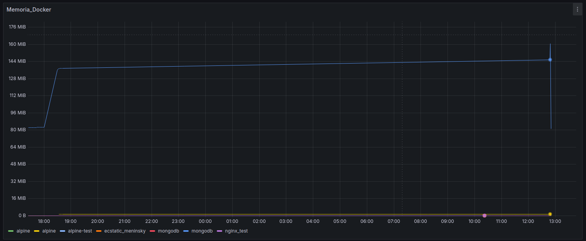

# Guía de Instalación y Configuración del Sistema de Monitorización (Influxdb_v2, Telegraf y Grafana)


---


# Índice de la Guía de Configuración del Sistema de Monitorización

1. Introducción
   - 1.1 Descripción general del sistema
   - 1.2 Estimación del tamaño diario de métricas y dashboards

2. Instalación y Configuración de InfluxDB
   - 2.0 Instalación de InfluxDB v2
   - 2.1 Requisitos
   - 2.2 Pasos de instalación
   - 2.3 Configuración inicial
     - A Con entorno grafico
     - B Sin entorno grafico
   - 2.4 Configurar InfluxDB como un Servicio

3. Instalación y Configuración de Telegraf
   - 3.1 Requisitos
   - 3.2 Pasos de instalación
   - 3.3 Configuración de entradas (`inputs`)
     - 3.3.1 Monitorización básica (CPU, memoria, disco)
     - 3.3.2 Monitorización de servicios web y contenedores Docker con JSON
   - 3.4 Configuración de salidas (`outputs`)
   - 3.5 Ejecución y verificación de Telegraf
   - 3.6 Configuración de Telegraf como servicio

4. Instalación y Configuración de Grafana
   - 4.1 Requisitos
   - 4.2 Pasos de instalación
   - 4.3 Configuración inicial
   - 4.4 Configuración de notificaciones por correo
   - 4.5 Importación de dashboards predefinidos
     - 4.5.1 Revisión del bucket y fuente de datos

5. Creación y Configuración de Dashboards
   - 5.1 Dashboard de Servidores (Servidores_OEG)
     - 5.1.1 Descripción del propósito
     - 5.1.2 Métricas mostradas
     - 5.1.3 Configuración de consultas en Grafana
   - 5.2 Dashboard de Servicios (Servicios_OEG)
     - 5.2.1 Descripción del propósito
     - 5.2.2 Métricas mostradas
     - 5.2.3 Configuración de consultas en Grafana
   - 5.3 Dashboard de Docker (Docker_OEG)
     - 5.3.1 Descripción del propósito
     - 5.3.2 Limitaciones del dashboard
     - 5.3.3 Paneles y descripción

6. Añadir Nuevos Servidores o Servicios
   - 6.1 Añadir un nuevo servidor
   - 6.2 Añadir un nuevo servicio o contenedor Docker
     - 6.2.1 Monitorización de servicios web (URLs)
     - 6.2.2 Monitorización de contenedores Docker

7. Configuración de Alertas en Grafana
   - 7.1 Introducción a las alertas
   - 7.2 Configuración inicial
     - 7.2.1 Crear una carpeta para las alertas
     - 7.2.2 Configurar un canal de notificación
   - 7.3 Personalización de las alertas
     - 7.3.1 Duplicar y personalizar una alerta
     - 7.3.2 Configurar el comportamiento de evaluación
     - 7.3.3 Añadir canales de notificación
   - 7.4 Mini Guía por Tipo de Alerta
     - 7.4.1 Alertas de CPU
     - 7.4.2 Alertas de memoria
     - 7.4.3 Alertas de disco
     - 7.4.4 Alertas de servicios
       - 7.4.4.1 Configuración de filtros por URL, nombre, palabras clave
       - 7.4.4.2 Ajustes para alertar por `status_code != 200`
     - 7.4.5 Alertas de contenedores Docker
       - 7.4.5.1 Configuración de filtros por nombre, palabras clave
       - 7.4.5.2 Ajustes para alertar por `status_code != 200`
   - 7.5 Verificación y pruebas de las alertas
   - 7.6 Recomendaciones adicionales


---
# 1. Introducción

## 1.1 Descripción General del Sistema 

Este sistema de monitorización combina tres herramientas clave: **InfluxDB**, **Telegraf** y **Grafana**, para ofrecer una solución eficiente y flexible para la recopilación, almacenamiento y visualización de métricas en servidores y servicios.

- **InfluxDB**: Una base de datos optimizada para manejar datos de series temporales, ideal para almacenar métricas con gran frecuencia de actualización.
- **Telegraf**: Un agente ligero que recopila datos de servidores y servicios (como URLs o contenedores Docker) y los envía a InfluxDB.
- **Grafana**: Una plataforma de visualización que transforma las métricas almacenadas en dashboards interactivos, fáciles de entender y personalizar.

El objetivo principal es centralizar la monitorización, facilitar la detección de problemas y ofrecer herramientas para tomar decisiones rápidas basadas en datos en tiempo real.


## 1.2 Estimación del Tamaño Diario de Métricas y Dashboards

Este apartado describe la estimación del tamaño diario de los datos enviados por diferentes métricas y paneles de un sistema de monitoreo basado en Docker, servicios, CPU, memoria y disco. La estimación se ha realizado considerando un solo contenedor de Docker, un solo servicio (URL), y un solo servidor que envía información de CPU, memoria y disco. 

La información se recoge a intervalos regulares de tiempo y se almacena en una base de datos temporal, lo que nos permite calcular el tamaño total que ocupa esta información diariamente.

### Tabla 1: Estimación de Métricas por Día

| **Métrica**           | **Puntos por 15 min** | **Tamaño por punto (bytes)** | **Puntos diarios (96 intervalos)** | **Tamaño diario (bytes)** | **Intervalo (s)** |
|-----------------------|-----------------------|------------------------------|------------------------------------|---------------------------|-------------------|
| **Docker (métricas)** | 7350                  | 63                           | 705600                             | 44.452.800                 | 5                 |
| **CPU**               | 2670                  | 96                           | 256320                             | 24.606.720                 | 5                 |
| **Memoria**           | 3054                  | 96                           | 293184                             | 28.149.696                 | 10                |
| **Disco**             | 712                   | 96                           | 68352                              | 6.561.792                  | 10                |
| **Docker (panel)**    | 60                    | 63                           | 5760                               | 362.880                    | 30                |
| **Servicio (panel)**  | 60                    | 135                          | 5760                               | 777.600                    | 30                |

### Tabla 2: Estimación de Dashboards por Día

| **Dashboard**            | **Métricas incluidas**                  | **Puntos diarios (96 intervalos)** | **Tamaño diario (bytes)** |
|--------------------------|----------------------------------------|------------------------------------|---------------------------|
| **Docker (métricas)**     | Docker                                 | 705600                             | 44.452.800                 |
| **Servidores**            | CPU, Memoria, Disco                    | 617856                             | 59.318.208                 |
| **Servicios**             | Docker (panel), Servicio (panel)       | 11520                              | 1.140.480                  |

### Cantidad Total Diaria

La suma total de los datos que se procesan diariamente en el sistema es de aproximadamente **104.911.488 bytes (≈ 100 MB por día)**, lo que corresponde al envío de datos de:

- **Un solo contenedor de Docker**.
- **Un solo servidor con métricas de CPU, memoria y disco**.
- **Un solo servicio URL**.

### Cómo se ha obtenido la estimación

La estimación del tamaño diario se ha realizado siguiendo los siguientes pasos:

1. **Cálculo del tamaño por punto de dato**:  
   - Se ha considerado el formato en que se envían los datos desde Docker, servicios y servidores.  
   - El tamaño de cada punto de dato se calcula sumando el tamaño de:
     - El **timestamp** (8 bytes).
     - Los **tags** y **campos** enviados en cada métrica (según su longitud estimada en caracteres).  
     - El **nombre de la métrica** (depende de la métrica específica).

2. **Cálculo de puntos diarios**:  
   - Se ha considerado que cada día tiene **96 intervalos de 15 minutos** (24 horas * 4 intervalos por hora).  
   - A partir del número de puntos enviados en cada intervalo de 15 minutos, se ha calculado el total diario multiplicando por 96.

3. **Cálculo del tamaño diario**:  
   - El tamaño diario de cada métrica se ha obtenido multiplicando el número total de puntos diarios por el tamaño estimado de cada punto de dato.

4. **Dashboards**:  
   - Se han agrupado las métricas correspondientes a cada dashboard.  
   - El tamaño total diario de cada dashboard se ha obtenido sumando el tamaño diario de las métricas que contiene.

### Consideraciones

- Esta estimación está basada en el envío de datos de **un solo contenedor**, **un solo servidor** y **un solo servicio**.  
- Si se agregan más contenedores, servidores o servicios, el tamaño total diario se incrementará proporcionalmente.
- Los tamaños estimados por punto de dato dependen de la longitud real de los tags y campos, por lo que pueden variar ligeramente en función de los valores reales enviados.

---

## Conclusión

Este análisis proporciona una estimación aproximada del espacio que ocupan las métricas y dashboards en el sistema diariamente. Con esta información, se puede planificar mejor el almacenamiento requerido y optimizar la gestión de datos en el entorno de monitoreo.


---
---

# 2.Guía de Instalación y Configuración de InfluxDB v2

## Descripción General
Esta guía detalla los pasos para instalar y configurar **InfluxDB v2** en servidores Linux usando binarios. InfluxDB v2 se utilizará para almacenar las métricas recolectadas por Telegraf y permitirá la visualización de los datos en Grafana.

---

## 2.0 Instalación de InfluxDB v2

### 2.1 Requisitos
- **Sistema Operativo**: Linux (64 bits). Para servidores de 32 bits o con otra arquitectura, consulta la página oficial de [InfluxData Downloads](https://portal.influxdata.com/downloads) para descargar la versión adecuada.

### 2.2 Pasos de Instalación

1. **Descargar el archivo binario de InfluxDB v2**: 

    ```bash
    wget https://download.influxdata.com/influxdb/releases/influxdb2-2.7.10_linux_amd64.tar.gz
    ```


2. **Descomprimir el archivo descargado**:

    ```bash
    tar xvfz influxdb2-2.7.10_linux_amd64.tar.gz
    ```

    Esto crea una carpeta llamada `influxdb2-2.7.10` que contiene los binarios de InfluxDB. Navega a `influxdb2-2.7.10/usr/bin` y podrás ver el ejecutable `influxd`.

3. **Iniciar el servidor de InfluxDB**:

    ```bash
    cd influxdb2-2.7.10/usr/bin
    ./influxd
    ```

    InfluxDB se iniciará en el puerto `8086`. Puedes verificar su funcionamiento accediendo a [http://localhost:8086](http://localhost:8086) desde un navegador web. Puedes cancelar la ejecucion con ctrl + C.


## 2.3 Configuración Inicial
### A. Servidor con Entorno Gráfico 

1. **Abrir la Interfaz de Configuración**: Accede a [http://localhost:8086](http://localhost:8086) en un navegador.

2. **Crear Usuario Administrador y Configuración Inicial**:

    - **Nombre de usuario**: Elige un nombre de usuario personalizado.
    - **Contraseña**: Configura una contraseña segura de tu elección.
    - **Organización**: Introduce un nombre descriptivo, como `MiOrganización`.
    - **Bucket**: Especifica un nombre para el bucket principal, como `MiBucket`.

---

Esta configuración inicial solo se realiza la primera vez que inicias InfluxDB v2. Después de configurar estos valores, podrás acceder a InfluxDB utilizando el nombre de usuario y la contraseña que hayas definido.


3. **Completar la Configuración**: Haz clic en **Continuar** para finalizar la configuración inicial.

---

#### 3. Configuración de API y Token de Acceso

Para permitir la conexión desde Telegraf u otras aplicaciones externas, necesitas un token de acceso.

1. Dirígete a **Data > Tokens** en la interfaz de InfluxDB.
2. **Crear un nuevo token** para tu organización. Guarda este token en un lugar seguro, ya que será necesario para las conexiones externas.

---

#### 4. Configuración de Retención de Datos

1. Navega a **Data > Buckets** en la interfaz de InfluxDB.
2. Selecciona el bucket que creaste durante la configuración inicial (ej. `MiBucket`).
3. Ajusta la **Retención de Datos** según sea necesario, por ejemplo, 30 días o 90 días, dependiendo de tus requisitos.

---

#### 5. Comprobación de la IP del Servidor y Preparación para la Conexión Externa de Telegraf

Para que otros servidores puedan enviar métricas a este servidor InfluxDB desde Telegraf, sigue estos pasos:

1. **Comprobar la IP del Servidor**:
   - Ejecuta el siguiente comando para obtener la dirección IP de la máquina donde está corriendo InfluxDB:
   
     ```bash
     hostname -I
     ```
   
   - Apunta la dirección IP obtenida, ya que la necesitarás para configurarla en los agentes Telegraf externos.

2. **Anotar Parámetros para Telegraf Externo**:
   - Anota los siguientes valores, ya que serán necesarios para configurar la conexión de Telegraf en los servidores externos:
     - **IP del Servidor InfluxDB**: La dirección IP obtenida en el paso anterior.
     - **Bucket**: El bucket donde deseas almacenar las métricas, por ejemplo, `MiBucket`.
     - **Token**: El token de autenticación para InfluxDB.
     - **Organización**: La organización configurada, como `MiOrganización`.

3. **Ejemplo de Configuración de Telegraf Externo(no hace falta configurar esto ahora)**:
   - En el siguiente apartado instalaremos telegraf en los servidores y escribiremos algo asi para configurar el destino de las metricas. Por lo que debes guardar la informacion.

     ```ini
     [[outputs.influxdb_v2]]
       urls = ["http://<IP_DEL_SERVIDOR_INFLUXDB>:8086"]
       token = "<mi_token>"
       organization = "<MiOrganización>"
       bucket = "<MiBucket>"
     ```


--- 


### B. Servidores sin Entorno Gráfico

#### 1. Descargar e Instalar el Cliente CLI

El cliente CLI de InfluxDB no se incluye en el paquete principal y debe descargarse por separado. Sigue estos pasos:

1. **Descargar el paquete del cliente CLI de InfluxDB**:
   ```bash
   wget https://dl.influxdata.com/influxdb/releases/influxdb2-client-2.7.5-linux-amd64.tar.gz
   ```

2. **Descomprimir el archivo descargado**:
   ```bash
   tar xvfz influxdb2-client-2.7.5-linux-amd64.tar.gz
   ```

3. **Mover el binario `influx` a un directorio incluido en tu variable `PATH`**:
   ```bash
   sudo mv influx /usr/local/bin/
   ```

4. **Verificar la instalación del cliente CLI**:
   ```bash
   influx version
   ```

Esto confirmará que el cliente CLI se instaló correctamente.

---

#### 2. Iniciar el servidor de InfluxDB

Ejecuta el siguiente comando para iniciar InfluxDB en el servidor: Este paso es necesario para poder configurar influxdb y que la CLI pueda comunicarse con influxdb

```bash
cd influxdb2-2.7.10/usr/bin
./influxd &
```

InfluxDB se ejecutará en el puerto `8086` por defecto. Deja este proceso corriendo en segundo plano(&) o abre otra terminal mientras este corre.

---

#### 3. Configuración Inicial mediante CLI

El cliente CLI de InfluxDB (`influx`) te permite realizar la configuración inicial sin necesidad de un navegador web. Sigue estos pasos:

1. **Acceder al CLI de InfluxDB**:
   
   Asegúrate de que el servidor `influxd` esté corriendo y luego ejecuta el cliente CLI desde cualquier terminal:
   
   ```bash
   influx setup
   ```

2. **Introducir los parámetros iniciales**:

   Durante la ejecución del comando `setup`, se te pedirá que introduzcas los siguientes valores:

   - **Nombre de usuario**: Introduce un nombre de usuario para el administrador.
   - **Contraseña**: Especifica una contraseña segura.
   - **Nombre de la organización**: Proporciona un nombre para la organización, por ejemplo, `MiOrganización`.
   - **Nombre del bucket**: Define un bucket para almacenar los datos (como nombre de la bbdd), como `MiBucket`.
   - **Duración de retención de datos** (en horas): Introduce el número de horas para la retención de datos. Si no deseas configurar una retención específica, puedes introducir `0` (sin límite de retención).


**te preguntara si todo es correcto(y/n)**  
    aceptamos


---

#### 4. Obtener el Token de Acceso

Si necesitas recuperar el token generado durante la configuración inicial, ejecuta el siguiente comando:

```bash
influx auth list
```

Esto mostrará una lista de tokens disponibles, junto con sus permisos. Copia el token que corresponda a tu configuración.desde que comienza el token hasta == .Este parametro sera necesario para telegraf.

---


## 2.4. Configurar InfluxDB como un Servicio

Para que InfluxDB se ejecute automáticamente cada vez que el servidor se inicie, puedes configurarlo como un servicio del sistema.

1. **Crear un archivo de servicio para systemd**:
   ```bash
   sudo nano /etc/systemd/system/influxdb.service
   ```

   Añade el siguiente contenido al archivo:
   ```ini
   [Unit]
   Description=InfluxDB Service
   After=network.target

   [Service]
   ExecStart=/ruta/completa/a/influxd
   Restart=always
   User=tu_usuario

   [Install]
   WantedBy=multi-user.target
   ```

   Reemplaza `/ruta/completa/a/influxd` con la ruta completa donde está ubicado el binario `influxd`.

2. **Recargar los servicios de systemd**:
   ```bash
   sudo systemctl daemon-reload
   ```

3. **Habilitar el servicio para que se inicie automáticamente**:
   ```bash
   sudo systemctl enable influxdb
   ```

4. **Iniciar el servicio**:
   ```bash
   sudo systemctl start influxdb
   ```

5. **Verificar el estado del servicio**:
   ```bash
   sudo systemctl status influxdb
   ```

---

Con esta guía, has instalado y configurado InfluxDB v2 en un entorno sin interfaz gráfica, listo para recibir y almacenar métricas. Y estara configurado como servicio. Cuando configuremos Telegraf, necesitaremos el nombre del bucket, el nombre de la organización, el token y la IP del servidor donde está corriendo InfluxDB.


# 3.Guía de Instalación y Configuración de Telegraf en Servidores

## Descripción General
Esta parte del documento explica los pasos para instalar y configurar el agente **Telegraf** para la recolección de métricas en servidores de Linux, con envío de datos a **InfluxDB** y la posterior visualizacion en **Grafana**. El propósito es simplificar el proceso de despliegue.

---

## 1. Instalación de Telegraf

### 3.1 Requisitos
- **Sistema Operativo**: Linux (64 bits). Si tu servidor es de 32 bits, consulta la página oficial de [InfluxData Downloads](https://portal.influxdata.com/downloads) para descargar la versión adecuada.

### 3.2 Pasos de Instalación
1. **Descargar el archivo binario de Telegraf**: 

    ```bash
    wget https://dl.influxdata.com/telegraf/releases/telegraf-1.32.2_linux_amd64.tar.gz
    ```
    

2. **Descomprimir el archivo descargado**:

    ```bash
    tar xf telegraf-1.32.2_linux_amd64.tar.gz
    ```

    Esto crea una carpeta llamada `telegraf-1.32.2/` con los binarios de Telegraf.

---

## 2. Configuración de Telegraf

Para configurar Telegraf, generaremos un archivo de configuración que incluya algunas de las métricas clave (CPU, memoria, disco) y el destino de los datos en InfluxDB v2.

1. **Acceder al directorio de Telegraf**:

    ```bash
    cd telegraf-1.32.2/usr/bin
    ```

2. **Generar el archivo de configuración `telegraf.conf`**:

    ```bash
    ./telegraf -sample-config -input-filter cpu:mem:disk -output-filter influxdb_v2 > telegraf.conf
    ```

    - `-sample-config`: Crea un archivo de configuración con ejemplos.
    - `-input-filter cpu:mem:disk`: Selecciona los plugins de input para monitorizar CPU, memoria y disco.
    - `-output-filter influxdb_v2`: Especifica InfluxDB v2 como el destino de las métricas.

## 3. Configuración de Parámetros en `telegraf.conf`

Para una configuración adecuada, vamos a dividir los parámetros en dos secciones: **Parámetros de Salida** y **Parámetros de Entrada**.

### Parámetros de Salida (`[[outputs]]`)

1. **Abrir `telegraf.conf` para editar**: (yo uso nano pero elija el que prefiera)

    ```bash
    nano telegraf.conf
    ```

2. **Buscar la sección de salida (`[[outputs]]`)**:
   - Usa un atajo en `nano` para buscar rápidamente la sección `[[outputs]]`:

     ```bash
     Ctrl + W y escribe [[outputs
     ```

3. **Configurar los parámetros de salida para InfluxDB v2**:
   En la sección `[[outputs.influxdb_v2]]`, define los valores de conexión hacia InfluxDB, los cuales hemos apuntado antes y tenemos a mano. Incluyendo la URL del servidor, el token de acceso, la organización y el bucket de almacenamiento:

   ```ini
   [[outputs.influxdb_v2]]
     urls = ["http://direccion_ip_influxdb:8086"]
     token = "mi_token"
     organization = "mi_organizacion"
     bucket = "mi_bucket"
   ```


### Parámetros de Entrada (`[[inputs]]`)

Los parámetros de entrada (`inputs`) son responsables de recoger las métricas que queremos monitorizar. En este documento, explicaremos cómo configurar tanto los plugins predefinidos como los personalizados (como `exec` para servicios web y contenedores Docker).

---

## 1. Localizar la sección de entrada (`[[inputs]]`)

Usa el siguiente atajo en `nano` para localizar rápidamente la sección `[[inputs]]` en el archivo `telegraf.conf`:

```bash
Ctrl + W y escribe [[inputs
```

---


## 2. Configuracion plugins

Actualmente, se han definido tres dashboards principales para monitorización. Cada uno utiliza diferentes plugins de entrada (`inputs`) de Telegraf:

- **Dashboard de Servidores**:  
  Monitorea el sistema general (CPU, memoria, disco) utilizando los plugins predefinidos: `cpu`, `mem`, y `disk`.  (Si hemos puesto el comando que mencionábamos antes, estos plugins se generan solos). Puedes verificar que están habilitados y configurados correctamente revisando las siguientes secciones:

  **Plugins requeridos**:  
  ```ini
  [[inputs.cpu]]
    percpu = true
    totalcpu = true
    collect_cpu_time = false
    report_active = false
  
  [[inputs.mem]]
    fieldpass = ["used_percent"]
  
  [[inputs.disk]]
    ignore_fs = ["tmpfs", "devtmpfs", "overlay"]
  ```

  **Configuración adicional con `global_tags`**:
  Para poder filtrar los servidores en el dashboard según ciertas condiciones (por ejemplo, aquellos que tienen MongoDB instalado), se ha añadido la siguiente configuración en `telegraf.conf` usando `global_tags`.

  **Ejemplo de configuración en `telegraf.conf`**:
  ```ini
  [global_tags]
    has_mongo = "true"  # Indica si el servidor tiene MongoDB
  ```
  Si un servidor no tiene MongoDB, el valor de `has_mongo` debe ser `false`. Esta configuración permite filtrar y comparar servidores por variables en el dashboard.

  También se pueden agregar otras variables de filtro de manera similar:
  ```ini
  [global_tags]
    has_mongo = "true"
    environment = "production"
    location = "datacenter-1"
  ```

  Después de actualizar el archivo `telegraf.conf`, asegúrate de reiniciar el servicio de Telegraf para que los cambios se apliquen correctamente:
  ```bash
  sudo systemctl restart telegraf
  ```
  

- **Dashboard de Servicios**:  
  Permite monitorizar el estado de servicios web y contenedores Docker mediante scripts de Python (`monitor_servicio.py` y `monitor_docker.py`).  
  **Plugins requeridos**:  
  ```ini
  [[inputs.exec]]  # Configurado para servicios
  [[inputs.exec]]  # Configurado para contenedores Docker mediante script
  ```

- **Dashboard Técnico de Docker**:  
  Proporciona información técnica y detallada sobre el consumo de recursos de los contenedores Docker (CPU, memoria, red y disco). No requiere scripts de Python.  
  **Plugin requerido**:  
  ```ini
  [[inputs.docker]]
  ```

---

## 2. Configuración del Plugin `[[inputs.docker]]`

Para el **Dashboard Técnico de Docker**, es necesario habilitar el plugin `docker` en el archivo `telegraf.conf`. Este plugin recopila métricas directamente del socket de Docker sin necesidad de scripts adicionales.

### Configuración:

```ini
[[inputs.docker]]
  endpoint = "unix:///var/run/docker.sock"  # Ruta al socket de Docker
  gather_services = false
  container_state_include = ["running", "paused", "exited"]  # Incluye estados de contenedores específicos
  interval = "5s"  # Intervalo de recolección de datos
  timeout = "5s"  # Tiempo máximo para obtener los datos
  container_name_include = []  # Opcional: especifica contenedores a incluir
  container_name_exclude = []  # Opcional: especifica contenedores a excluir
```

### Notas:
- Asegúrate de que el usuario que ejecuta Telegraf tiene permisos para acceder al socket de Docker (`/var/run/docker.sock`). Puedes configurarlo así:  
  ```bash
  sudo usermod -aG docker telegraf
  ```

---

## 3. Relación entre Dashboards y Plugins

| Dashboard               | Plugins Utilizados                                          | Detalles                                                    |
|--------------------------|------------------------------------------------------------|------------------------------------------------------------|
| **Servidores**           | `cpu`, `mem`, `disk`                                       | No requiere configuración adicional.                       |
| **Servicios**            | `exec` (servicios y contenedores mediante scripts)         | Usa los scripts `monitor_servicio.py` y `monitor_docker.py`.|
| **Técnico de Docker**    | `docker`                                                   | Recopila métricas de contenedores directamente de Docker.   |

---

## 4. Configuración General de los Plugins `exec`

### Configuración del plugin `exec` para el Dashboard de Servicios:

```ini
[[inputs.exec]]
  commands = ["python3 /ruta/completa/a/scripts/monitor_servicio.py"]  # Script para servicios web
  interval = "30s"  # Intervalo de ejecución
  timeout = "10s"  # Tiempo máximo permitido
  data_format = "influx"  # Formato de los datos
  name_override = "servicio_gen"  # Nombre de la medición
  [inputs.exec.tags]
    url = "servicio_general"

[[inputs.exec]]
  commands = ["python3 /ruta/completa/a/scripts/monitor_docker.py"]  # Script para contenedores Docker
  interval = "30s"
  timeout = "10s"
  data_format = "influx"
  name_override = "docker_gen"
  [inputs.exec.tags]
    url = "docker_general"
```

### Configuración de Archivos JSON y Scripts
- **JSON utilizados**:
  - `servicios.json` y `dockers.json` (deben estar en la ruta configurada en los scripts).  
- **Ruta completa de los scripts**:  
  Asegúrate de incluir la ruta absoluta en los comandos de los plugins `exec`.

### Notas sobre la configuración:

- **Ruta completa a los scripts**
  - Ejemplo de rutas absolutas:
    ```bash
    /home/usuario/tfg/scripts/servicios.py
    /home/usuario/tfg/scripts/dockers.py
    ```

- **Ubicación de los JSON**
  - `servicios.json`: `/home/usuario/tfg/scripts/servicios.json`
  - `dockers.json`: `/home/usuario/tfg/scripts/dockers.json`

- **Intervalo de ejecución**
  - El intervalo (`interval = "30s"`) puede ajustarse según tus necesidades. Intervalos más cortos permiten detectar problemas rápidamente, pero incrementan la carga del sistema.

---


## 4. Ejecutar Telegraf

Ahora que hemos configurado `telegraf.conf`, podemos ejecutar Telegraf y enviar las métricas configuradas a InfluxDB. Esto permitirá monitorear las métricas desde la base de datos.

### Pasos para Ejecutar Telegraf

1. **Navegar a la Carpeta de Telegraf**:
   - Ve al directorio donde se encuentra el binario de Telegraf. Por ejemplo:
     ```bash
     cd telegraf-1.32.2/usr/bin
     ```

2. **Ejecutar Telegraf**:
   - Usa el siguiente comando para ejecutar Telegraf con la configuración definida en `telegraf.conf`:
     ```bash
     ./telegraf --config telegraf.conf
     ```

### Verificación

- Una vez ejecutado, Telegraf comenzará a enviar las métricas a InfluxDB.
- Puedes verificar que las métricas están siendo recibidas correctamente desde la interfaz de InfluxDB, accediendo a **Data Explorer** y ejecutando una consulta para revisar las métricas.


### 5 Configurar Telegraf como un Servicio

#### Descripción General

Esta guía explica cómo configurar **Telegraf** como un servicio utilizando **systemd** en sistemas Linux. Al configurarlo como un servicio, **Telegraf** se ejecutará automáticamente cada vez que el servidor se inicie, asegurando que las métricas se recojan y envíen continuamente a **InfluxDB** sin necesidad de intervención manual.

---

#### 1. Crear un archivo de servicio para systemd

1. Abre un terminal y crea un archivo de servicio para Telegraf en el directorio de configuración de systemd:
   ```bash
   sudo nano /etc/systemd/system/telegraf.service
   ```

2. Añade el siguiente contenido al archivo:
   ```ini
   [Unit]
   Description=Telegraf Service
   After=network.target

   [Service]
   ExecStart=/ruta/completa/a/telegraf --config /ruta/completa/a/telegraf.conf
   Restart=always
   User=tu_usuario

   [Install]
   WantedBy=multi-user.target
   ```

   - **`ExecStart`**: Especifica la ruta completa al binario de Telegraf y al archivo de configuración (`telegraf.conf`). Por ejemplo:
     ```bash
     ExecStart=/home/luisgarcia/telegraf-1.32.2/usr/bin/telegraf --config /home/luisgarcia/telegraf-1.32.2/usr/bin/telegraf.conf
     ```
   - **`User`**: Cambia `tu_usuario` por el usuario que ejecutará el servicio (por ejemplo, `luisgarcia`).

---

#### 2. Recargar systemd

Después de guardar el archivo, recarga los demonios de **systemd** para que el nuevo archivo de servicio sea reconocido:
```bash
sudo systemctl daemon-reload
```

---

#### 3. Habilitar el servicio para inicio automático

Habilita el servicio para que se ejecute automáticamente cada vez que el servidor arranque:
```bash
sudo systemctl enable telegraf
```

---

#### 4. Iniciar el servicio de Telegraf

Inicia el servicio de Telegraf manualmente para comprobar que funciona correctamente:
```bash
sudo systemctl start telegraf
```

---

#### 5. Verificar el estado del servicio

Revisa el estado del servicio para confirmar que está corriendo sin problemas:
```bash
sudo systemctl status telegraf
```

Si el servicio se está ejecutando correctamente, deberías ver una salida indicando que está activo (`Active: active (running)`).

---

#### 6. Logs del servicio

Para depurar problemas o verificar que Telegraf está funcionando correctamente, puedes consultar los logs del servicio:
```bash
sudo journalctl -u telegraf -f
```

Esto mostrará los eventos en tiempo real relacionados con el servicio de Telegraf.

---

#### 7. Notas adicionales

- **Permisos de usuario**: Asegúrate de que el usuario especificado en `User` tenga permisos para acceder al archivo de configuración (`telegraf.conf`) y ejecutar cualquier script asociado.
- **Plugins personalizados**: Si estás utilizando plugins como `exec`, asegúrate de que las rutas especificadas en los comandos son accesibles y tienen los permisos correctos.
- **Prueba del servicio**: Después de configurar, realiza una consulta en InfluxDB para confirmar que las métricas están siendo enviadas correctamente.

Con esta configuración, Telegraf estará listo para ejecutarse automáticamente y garantizar una recolección continua de métricas.


# 4.Guía de Instalación y Configuración de Grafana

## Descripción General
Esta guía detalla los pasos para instalar y configurar **Grafana** en servidores Linux. Grafana se utilizará para visualizar los datos almacenados en InfluxDB v2 y generados por Telegraf.

---

## 1. Instalación de Grafana

### Requisitos
- **Sistema Operativo**: Linux (64 bits). Para otras arquitecturas o sistemas, consulta la página oficial de [Grafana Downloads](https://grafana.com/grafana/download).
- **InfluxDB v2**: Asegúrate de que InfluxDB esté instalado y funcionando antes de configurar Grafana.

### Pasos de Instalación

1. **Descargar el archivo binario de Grafana**:

    ```bash
    wget https://dl.grafana.com/enterprise/release/grafana-enterprise-11.3.0+security-01.linux-amd64.tar.gz
    ```
    


2. **Descomprimir el archivo descargado**:

    ```bash
    tar -zxvf grafana-enterprise-11.3.0+security-01.linux-amd64.tar.gz
    ```

    Esto crea una carpeta llamada `grafana-v11.3.0` con los binarios de Grafana.

3. **Iniciar el servidor de Grafana**:

    ```bash
    cd grafana-v11.3.0/bin
    ./grafana-server
    ```

    Grafana se iniciará en el puerto `3000` por defecto. Puedes verificar su funcionamiento accediendo a [http://localhost:3000](http://localhost:3000) desde un navegador web.

---

## 2. Configuración Inicial de Grafana

1. **Acceso a la Interfaz Web**:
   - Abre un navegador web y accede a [http://localhost:3000](http://localhost:3000).

2. **Inicio de Sesión**:
   - **Usuario predeterminado**: `admin`
   - **Contraseña predeterminada**: `admin`
   - Cambia la contraseña predeterminada al iniciar sesión por primera vez.

3. **Configurar la Fuente de Datos**:
   - Una vez dentro de la interfaz de Grafana:
     1. Ve a **Settings (Configuración)** > **Data Sources (Fuentes de Datos)**.
     2. Haz clic en **Add Data Source**.
     3. Selecciona **InfluxDB** como fuente de datos.

4. **Configurar los Detalles de Conexión**:
   - Rellena los campos con los datos de tu servidor InfluxDB:
     - **URL**: `http://IP_DEL_SERVIDOR_INFLUXDB:8086`
     - **Organization**: El nombre de tu organización, como `MiOrganización`.
     - **Bucket**: El bucket configurado en InfluxDB, como `MiBucket`.
     - **Token**: El token de acceso generado en InfluxDB.

5. **Probar la Conexión**:
   - Haz clic en el botón **Save & Test** para verificar la conexión con InfluxDB.
   - Si todo está configurado correctamente, aparecerá un mensaje indicando que la conexión fue exitosa.

---

## Configuración del Correo en Grafana (`grafana.ini`)

Para configurar el envío de notificaciones por correo desde Grafana, debes modificar el archivo `grafana.ini`. A continuación, te explico los pasos:

### Pasos para Configurar el Correo SMTP

1. **Copiar y Renombrar el Archivo `default.ini`**:
   - En la carpeta `grafana/conf`, encontrarás un archivo llamado `default.ini`. Este archivo contiene la configuración base.
   - Haz una copia y renómbrala como `grafana.ini`:
     ```bash
     cp default.ini grafana.ini
     ```

2. **Editar la Sección `[smtp]` en `grafana.ini`**:
   - Abre el archivo `grafana.ini` para editarlo:
     ```bash
     nano grafana.ini
     ```
   - Busca la sección `[smtp]` y configura los siguientes parámetros:
     ```ini
     [smtp]
     enabled = true
     host = smtp.gmail.com:587
     user = tu_correo@gmail.com
     password = contraseña_por_token
     cert_file =
     key_file =
     skip_verify = true
     from_address = tu_correo@gmail.com
     from_name = grafana
     ehlo_identity = grafana.local
     startTLS_policy = OpportunisticStartTLS
     enable_tracing = false
     ```

   - **Nota importante**: Para obtener la contraseña por token:
     1. Ve a tu cuenta de Google y genera una contraseña específica para aplicaciones.
     2. Usa esta contraseña en el campo `password`.

3. **Guardar y Aplicar los Cambios**:
   - Guarda los cambios en `grafana.ini` y cierra el editor.
   - Si Grafana ya está en ejecución, corta la ejecución actual.
   - Ve al directorio principal de Grafana (`grafana-v11.2.0`) y ejecuta el siguiente comando para iniciar Grafana con la configuración actualizada:
     ```bash
     ./bin/grafana-server --config conf/grafana.ini
     ```

4. **Probar el Correo**:
   - Ve a **Configuration > Notification Channels** en la interfaz de Grafana.
   - Configura un canal de notificación con el correo configurado y realiza una prueba para verificar que funciona.
   - 
   

## 3. Importar un Dashboard en Grafana

Después de configurar Grafana y conectar las fuentes de datos, el siguiente paso es importar un dashboard predefinido para visualizar los datos. A continuación, se detallan los pasos para importar un dashboard desde un archivo JSON, como los que se pueden encontrar en repositorios de GitHub.

### Pasos para Importar un Dashboard

1. **Accede a la Sección de Dashboards**:
   - En la barra lateral izquierda de Grafana, selecciona **"Dashboards"**.
   - En la parte superior derecha, haz clic en el botón azul **"New"**.

2. **Selecciona la Opción "Import"**:
   - En el menú desplegable, selecciona la opción **"Import"**.

3. **Carga el Archivo JSON**:
   - Desde la página de importación, tienes dos opciones para cargar el dashboard:
     - **Subir un archivo JSON**:
       - Haz clic en **"Upload JSON file"** y selecciona el archivo JSON del dashboard que deseas importar.
     - **Pegar el JSON**:
       - Si tienes el código JSON, pégalo directamente en el cuadro de texto proporcionado.

4. **Configura el Dashboard Importado**:
   - Se te pedirá que selecciones o confirmes la **fuente de datos** asociada al dashboard. Asegúrate de elegir la fuente correcta (por ejemplo, InfluxDB configurado previamente).

5. **Haz clic en "Import"**:
   - Una vez que hayas configurado la fuente de datos, haz clic en el botón **"Import"**.

6. **Verifica el Dashboard Importado**:
   - El dashboard aparecerá inmediatamente en tu lista de dashboards.
   - Ábrelo y verifica que los datos se estén mostrando correctamente según las métricas configuradas.

### Notas Adicionales

- **Revisión del Bucket:**
  - En las ultimas actualizaciones se ha establecido el bucket como variable para no tener que modificar nada del dashboard

- **Dónde Encontrar Dashboards JSON**:
  - Puedes encontrar el dashboard en github/dashboards
  


## 4.Configurar Grafana como un Servicio en Linux

Esta guía detalla los pasos para configurar Grafana como un servicio utilizando `systemd` en sistemas Linux. Al configurarlo como un servicio, Grafana se iniciará automáticamente cada vez que el sistema arranque, asegurando su disponibilidad continua.

---

### 1. Crear un archivo de servicio para systemd

Abre un terminal y crea un archivo de servicio para Grafana en el directorio de configuración de `systemd`:

```bash
sudo nano /etc/systemd/system/grafana.service
```

Añade el siguiente contenido al archivo:

```ini
[Unit]
Description=Grafana Service
After=network.target

[Service]
ExecStart=/home/.../grafana-v11.3.0/bin/grafana-server --homepath /home/.../grafana-v11.3.0
Restart=always
User=usuario_con_permisos
Group=grupo_con_permisos

[Install]
WantedBy=multi-user.target
```

- **ExecStart:** Especifica la ruta completa al binario de Grafana y el directorio `homepath`.
- **User y Group:** Se utilizan para definir el usuario y grupo bajo los cuales se ejecutará el servicio. Reemplaza `usuario_generico` y `grupo_generico` por los valores adecuados en tu entorno.

Guarda y cierra el archivo.

---

### 2. Recargar systemd

Recarga los demonios de `systemd` para que el nuevo archivo de servicio sea reconocido:

```bash
sudo systemctl daemon-reload
```

---

### 3. Iniciar el servicio de Grafana

Inicia el servicio de Grafana manualmente para comprobar que funciona correctamente:

```bash
sudo systemctl start grafana
```

---

### 4. Verificar el estado del servicio

Revisa el estado del servicio para confirmar que está corriendo sin problemas:

```bash
sudo systemctl status grafana
```

Si el servicio se está ejecutando correctamente, deberías ver una salida indicando que está activo:

```
Active: active (running)
```

---

### 5. Habilitar el inicio automático del servicio

Para que Grafana se inicie automáticamente cada vez que el sistema arranque, habilita el servicio:

```bash
sudo systemctl enable grafana
```

Si el comando se ejecuta correctamente, deberías ver un mensaje como:

```
Created symlink /etc/systemd/system/multi-user.target.wants/grafana.service → /etc/systemd/system/grafana.service.
```

---

### 6. Ver logs del servicio (opcional)

Para depurar problemas o verificar que Grafana está funcionando correctamente, puedes consultar los logs del servicio:

```bash
sudo journalctl -u grafana -f
```

Este comando mostrará los eventos en tiempo real relacionados con el servicio de Grafana.

---

### 7. Notas adicionales

- **Puertos en uso:** Si Grafana no se inicia correctamente y muestra un error como `bind: address already in use`, verifica que el puerto `3000` no esté siendo utilizado por otro proceso.
  
  Puedes listar los procesos que están utilizando el puerto `3000` con:
  
  ```bash
  sudo lsof -i :3000
  ```
  
  Si encuentras otro proceso usando el puerto, detén ese proceso o cambia el puerto en la configuración de Grafana.

Con esta configuración, Grafana estará listo para ejecutarse automáticamente y garantizar una visualización continua de las métricas monitoreadas.


---


## 5. Definición y Descripción de los Dashboards

### 5.1 Dashboard de Servidores (Servidores_OEG)


Este dashboard está diseñado para monitorizar el rendimiento y estado de diferentes servidores mediante tres paneles principales: **CPU**, **Memoria** y **Disco**. Además, ofrece la posibilidad de filtrar las métricas por diferentes variables clave, lo que permite una comparación y un análisis detallado según las necesidades del usuario.

#### **Paneles y Descripción**

1. **Porcentaje de CPU**:


   - Este panel muestra el uso de CPU de cada servidor en un rango de tiempo definido.
   - La consulta utilizada para este panel es:
     ```flux
     from(bucket: "${bucket}")
       |> range(start: v.timeRangeStart, stop: v.timeRangeStop)
       |> filter(fn: (r) => r["host"] =~ /${host:regex}/)
       |> filter(fn: (r) => r["has_mongo"] =~ /${Mongo:regex}/)
       |> filter(fn: (r) => r["cpu"] == "cpu-total")
       |> filter(fn: (r) => r["_field"] == "usage_idle")
       |> aggregateWindow(every: v.windowPeriod, fn: mean, createEmpty: false)
       |> map(fn: (r) => ({ r with _value: 100.0 - r._value }))
       |> yield(name: "mean")
     ```
   - La consulta calcula el porcentaje de uso de CPU, restando el valor de "idle" al 100%.
   - Este panel es una **serie temporal**, lo que permite seleccionar cualquier espacio de tiempo y visualizar cómo ha variado el uso de CPU durante el periodo seleccionado.
   - Elegir una **serie temporal** permite también la comparación de los diferentes servidores en el mismo rango de tiempo.
   - Al estar representado en **porcentajes**, se obtiene una idea visual rápida del uso de CPU. Además, el fondo del panel cambia de color según el nivel de uso: verde para menos del 80%, amarillo entre 80% y 90%, y rojo cuando supera el 90%.
   - Además, si se configuran alertas vinculadas al panel, es posible identificar fácilmente los momentos en los que se han activado o recuperado dichas alertas.

2. **Porcentaje de Memoria**:


   - Este panel muestra el porcentaje de memoria utilizada en cada servidor.
   - La consulta utilizada para este panel es:
     ```flux
     from(bucket: "${bucket}")
       |> range(start: v.timeRangeStart, stop: v.timeRangeStop)
       |> filter(fn: (r) => r["_measurement"] == "mem")
       |> filter(fn: (r) => r["_field"] == "free" or r["_field"] == "used")
       |> filter(fn: (r) => r["host"] =~ /${host:regex}/)
       |> filter(fn: (r) => r["has_mongo"] =~ /${Mongo:regex}/)
       |> aggregateWindow(every: v.windowPeriod, fn: mean, createEmpty: false)
       |> pivot(rowKey:["_time"], columnKey: ["_field"], valueColumn: "_value")
       |> map(fn: (r) => ({
             _time: r._time,
             _value: float(v: r["used"]) / (float(v: r["free"]) + float(v: r["used"])) * 100.0,
             host: r.host
           }))
       |> yield(name: "mean")
     ```
   - La consulta calcula el porcentaje de memoria usada dividiendo la memoria usada entre el total disponible (usada + libre).
   - Este panel también es una **serie temporal**, lo que facilita el análisis histórico y la detección de patrones de uso.
   - Elegir una **serie temporal** permite también la comparación de los diferentes servidores en el mismo rango de tiempo.
   - Al estar representado en **porcentajes**, se obtiene una idea visual rápida del uso de memoria, con el mismo sistema de colores: verde para menos del 80%, amarillo entre 80% y 90%, y rojo cuando supera el 90%.

3. **Porcentaje de Disco**:


   - Este panel muestra el porcentaje de espacio de disco utilizado en cada servidor.
   - La consulta utilizada para este panel es:
     ```flux
     from(bucket: "${bucket}")
       |> range(start: v.timeRangeStart, stop: v.timeRangeStop)
       |> filter(fn: (r) => r["_measurement"] == "disk")
       |> filter(fn: (r) => r["_field"] == "used_percent" or r["_field"] == "free_percent")
       |> filter(fn: (r) => r["host"] =~ /${host:regex}/)
       |> filter(fn: (r) => r["has_mongo"] =~ /${Mongo:regex}/)
       |> aggregateWindow(every: v.windowPeriod, fn: mean, createEmpty: false)
       |> yield(name: "mean")
     ```
   - La consulta selecciona los campos de porcentaje de disco usado y libre, y muestra el promedio de uso en el rango de tiempo seleccionado.
   - Al igual que los paneles anteriores, es una **serie temporal**, lo que permite una visualización clara y sencilla del uso de disco a lo largo del tiempo.
   - Elegir una **serie temporal** permite también la comparación de los diferentes servidores en el mismo rango de tiempo.
   - Al estar representado en **porcentajes**, se obtiene una idea visual rápida del uso de disco, con el mismo sistema de colores: verde para menos del 80%, amarillo entre 80% y 90%, y rojo cuando supera el 90%.

#### **Variables de Filtro**

Este dashboard permite filtrar las métricas mostradas utilizando tres variables clave:

1. **Host**: Permite seleccionar uno o varios servidores específicos.
2. **Mongo**: Permite filtrar los servidores según si tienen MongoDB instalado o no, gracias a la configuración de `global_tags` en el archivo `telegraf.conf`.
3. **Bucket**: Permite seleccionar el bucket desde el cual se extraerán los datos, evitando la necesidad de modificar el dashboard manualmente cuando se cambian los buckets.

#### **Ventajas del Dashboard**

- **Visualización en serie temporal**: Al utilizar paneles de serie temporal, se puede seleccionar cualquier espacio de tiempo para visualizar la evolución de las métricas.
- **Configuración flexible**: Gracias a las variables de filtro, el dashboard es altamente configurable y permite un análisis rápido y personalizado.
- **Compatibilidad con alertas**: La configuración de paneles en serie temporal permite vincular alertas y visualizar directamente en el dashboard los momentos en los que se han activado o recuperado.
- **Indicadores visuales claros**: El uso de porcentajes junto con el sistema de colores del fondo (verde, amarillo y rojo) permite una comprensión rápida del estado de cada métrica.

---

### 5.2 Dashboard de Servicios (Servicios_OEG)


Este dashboard se encarga de monitorizar el estado de contenedores Docker y servicios web mediante dos scripts de Python que se ejecutan cada 30 segundos: `monitor_docker.py` y `monitor_servicio.py`. Los scripts obtienen información de un archivo JSON donde el usuario puede añadir las URLs o contenedores junto con la información necesaria.

#### **Paneles y Descripción**

1. **Estado de los Contenedores Docker (Tabla)**:


   - Este panel muestra el estado actual de los contenedores Docker.
   - Se utiliza un código de color para representar el estado:
     - **Verde**: Contenedor activo.
     - **Rojo**: Contenedor caído.
   - La consulta utilizada para este panel es:
     ```flux
     from(bucket: "${bucket}")
       |> range(start: v.timeRangeStart, stop: v.timeRangeStop)
       |> filter(fn: (r) => r["_measurement"] == "docker_gen")
       |> filter(fn: (r) => r["_field"] == "message" or r["_field"] == "status_code" or r["_field"] == "keywords")
       |> pivot(rowKey:["_time"], columnKey: ["_field"], valueColumn: "_value")
       |> group()
       |> sort(columns: ["_time"], desc: true)
       |> unique(column: "nombre")
       |> keep(columns: ["_time", "nombre", "keywords", "status_code", "message"])
     ```

2. **Estado de los Servicios Web (Tabla)**:


   - Este panel muestra el estado actual de los servicios web.
   - Se utiliza un código de color para representar el estado según el código de respuesta HTTP:
     - **Verde**: Respuesta correcta (2xx).
     - **Amarillo**: Error del cliente (4xx).
     - **Rojo**: Error del servidor (5xx).
   - La consulta utilizada para este panel es:
     ```flux
     from(bucket: "${bucket}")
       |> range(start: v.timeRangeStart, stop: v.timeRangeStop)
       |> filter(fn: (r) => r["_measurement"] == "servicio_gen")
       |> filter(fn: (r) => r["_field"] == "message" or r["_field"] == "status_code")
       |> pivot(rowKey:["_time"], columnKey: ["_field"], valueColumn: "_value")
       |> group()
       |> sort(columns: ["_time"], desc: true)
       |> unique(column: "url")
       |> keep(columns: ["_time", "url", "nombre", "keywords", "status_code", "message", "servidor", "proyecto", "maquina_virtual", "administrador"])
     ```

#### **Paneles de Alertas**

1. **Alertas de Docker**:


   - Este panel muestra la evolución de los códigos de estado de los contenedores Docker a lo largo del tiempo.
   - La consulta utilizada es:
     ```flux
     from(bucket: "DatosPrueba")
       |> range(start: v.timeRangeStart, stop: v.timeRangeStop)
       |> filter(fn: (r) => r["_measurement"] == "docker_gen")
       |> filter(fn: (r) => r["_field"] == "status_code")
       |> pivot(rowKey: ["_time"], columnKey: ["_field"], valueColumn: "_value")
       |> keep(columns: ["_time", "nombre", "status_code"])
     ```

2. **Alertas de Servicios**:



   - Este panel muestra la evolución de los códigos de estado de los servicios web a lo largo del tiempo.
   - La consulta utilizada es:
     ```flux
     from(bucket: "DatosPrueba")
       |> range(start: v.timeRangeStart, stop: v.timeRangeStop)
       |> filter(fn: (r) => r["_measurement"] == "servicio_gen")
       |> filter(fn: (r) => r["_field"] == "status_code")
       |> pivot(rowKey: ["_time"], columnKey: ["_field"], valueColumn: "_value")
       |> keep(columns: ["_time", "url", "status_code"])
     ```

#### **Panel de Estado de Servicios (Queso)**


   - Este panel muestra una representación gráfica del estado general de los servicios mediante un gráfico tipo "queso".
   - La consulta utilizada es:
     ```flux
     from(bucket: "${bucket}")
       |> range(start: v.timeRangeStart, stop: v.timeRangeStop)
       |> filter(fn: (r) => r["_measurement"] == "servicio_gen")
       |> filter(fn: (r) => r["_field"] == "status_code")
       |> group(columns: ["url"])
       |> sort(columns: ["_time"], desc: true)
       |> unique(column: "url")
       |> map(fn: (r) => ({
           r with
           _value: if r._value < 300 then "Éxito"
                   else if r._value < 400 then "Redirección"
                   else if r._value < 500 then "Error del Cliente"
                   else "Error del Servidor"
       }))
       |> group(columns: ["_value"])
       |> count(column: "url")
       |> yield(name: "status_distribution")
     ```

#### **Ventajas del Dashboard**

- **Visualización clara mediante tablas**: Permite ver rápidamente el estado actual de los contenedores y servicios, lo que facilita la detección de problemas.
- **Filtros avanzados**: Los usuarios pueden filtrar por cualquier variable disponible (nombre, status_code, administrador, proyecto, etc.) y ordenar los resultados según sus necesidades.
- **Paneles de alertas y estado histórico**: Los paneles de alertas permiten ver la evolución de los contenedores y servicios en el tiempo, y el panel tipo "queso" ofrece una visión rápida del estado general.

---


### 5.3.Dashboard de Docker (Docker_OEG)


Este dashboard ha sido creado debido a la complicación que supone tener Python instalado en los servidores para monitorizar contenedores Docker. A diferencia del dashboard de **Servicios**, donde solo se necesita un servidor central con Python que consulte las URLs, en Docker no todos los usuarios tienen la posibilidad o la voluntad de instalar Python en sus servidores. Este dashboard soluciona ese problema utilizando el plugin nativo de Docker de Telegraf.

#### **Limitaciones del Dashboard**

- No tiene la posibilidad de crear una tabla que indique qué contenedores están activos y cuáles no.
- Para saber qué contenedores están activos, se debe revisar visualmente los paneles de series temporales y comprobar si hay métricas disponibles para cada contenedor.

#### **Paneles y Descripción**

1. **Estado Dockers (Barras)**:


   - Este panel muestra información general sobre el estado de los contenedores Docker, incluyendo:
     - **Contenedores Activos**.
     - **Contenedores Parados**.
     - **Contenedores Pausados**.
     - **Imágenes Disponibles**.
   - La consulta utilizada para este panel es:
     ```flux
     union(
       tables: [
         from(bucket: "${bucket}")
           |> range(start: v.timeRangeStart, stop: v.timeRangeStop)
           |> filter(fn: (r) => r["_measurement"] == "docker")
           |> filter(fn: (r) => r["_field"] == "n_containers_running")
           |> aggregateWindow(every: v.windowPeriod, fn: mean, createEmpty: false)
           |> map(fn: (r) => ({ _value: r._value, metric: "Contenedores Activos" })),
         from(bucket: "${bucket}")
           |> range(start: v.timeRangeStart, stop: v.timeRangeStop)
           |> filter(fn: (r) => r["_measurement"] == "docker")
           |> filter(fn: (r) => r["_field"] == "n_containers_stopped")
           |> aggregateWindow(every: v.windowPeriod, fn: mean, createEmpty: false)
           |> map(fn: (r) => ({ _value: r._value, metric: "Contenedores Parados" })),
         from(bucket: "${bucket}")
           |> range(start: v.timeRangeStart, stop: v.timeRangeStop)
           |> filter(fn: (r) => r["_measurement"] == "docker")
           |> filter(fn: (r) => r["_field"] == "n_containers_paused")
           |> aggregateWindow(every: v.windowPeriod, fn: mean, createEmpty: false)
           |> map(fn: (r) => ({ _value: r._value, metric: "Contenedores Pausados" })),
         from(bucket: "${bucket}")
           |> range(start: v.timeRangeStart, stop: v.timeRangeStop)
           |> filter(fn: (r) => r["_measurement"] == "docker")
           |> filter(fn: (r) => r["_field"] == "n_images")
           |> aggregateWindow(every: v.windowPeriod, fn: mean, createEmpty: false)
           |> map(fn: (r) => ({ _value: r._value, metric: "Imágenes Disponibles" }))
       ]
     )
       |> rename(columns: { _value: "Valor", metric: "Métrica" })
       |> group(columns: ["Métrica"])
     ```

2. **CPU Docker (Serie Temporal)**:


   - Este panel muestra el uso de CPU de los contenedores Docker a lo largo del tiempo.
   - La consulta utilizada es:
     ```flux
     from(bucket: "${bucket}")
       |> range(start: v.timeRangeStart, stop: v.timeRangeStop)
       |> filter(fn: (r) => r["_measurement"] == "docker_container_cpu")
       |> filter(fn: (r) => r["_field"] == "usage_percent")
       |> filter(fn: (r) => r["container_name"] =~ /${container:regex}/)
       |> aggregateWindow(every: v.windowPeriod, fn: mean, createEmpty: false)
       |> yield(name: "mean")
     ```

3. **Memoria Docker (Serie Temporal)**:



   - Este panel muestra el consumo de memoria de los contenedores Docker.
   - La consulta utilizada es:
     ```flux
     from(bucket: "${bucket}")
       |> range(start: v.timeRangeStart, stop: v.timeRangeStop)
       |> filter(fn: (r) => r["_measurement"] == "docker_container_mem")
       |> filter(fn: (r) => r["_field"] == "usage")
       |> filter(fn: (r) => r["container_name"] =~ /${container:regex}/)
       |> aggregateWindow(every: v.windowPeriod, fn: mean, createEmpty: false)
       |> yield(name: "mean")
     ```

4. **Disco Docker (Serie Temporal)**:


   - Este panel muestra el uso de disco de los contenedores Docker.
   - La consulta utilizada es:
     ```flux
     from(bucket: "${bucket}")
       |> range(start: v.timeRangeStart, stop: v.timeRangeStop)
       |> filter(fn: (r) => r["_measurement"] == "docker_container_blkio")
       |> filter(fn: (r) => r["_field"] == "io_service_bytes_recursive_read" or r["_field"] == "io_service_bytes_recursive_write")
       |> filter(fn: (r) => r["container_name"] =~ /${container:regex}/)
       |> aggregateWindow(every: v.windowPeriod, fn: mean, createEmpty: false)
       |> yield(name: "mean")
     ```

5. **Consumo de Red Docker (Serie Temporal)**:


   - Este panel muestra el consumo de red de los contenedores Docker, tanto en tráfico de entrada (**rx_bytes**) como de salida (**tx_bytes**).
   - La consulta utilizada es:
     ```flux
     from(bucket: "${bucket}")
       |> range(start: v.timeRangeStart, stop: v.timeRangeStop)
       |> filter(fn: (r) => r["_measurement"] == "docker_container_net")
       |> filter(fn: (r) => r["_field"] == "rx_bytes" or r["_field"] == "tx_bytes")
       |> filter(fn: (r) => r["container_name"] =~ /${container:regex}/)
       |> aggregateWindow(every: v.windowPeriod, fn: mean, createEmpty: false)
       |> yield(name: "mean")
     ```

#### **Ventajas del Dashboard**

- **Panel de estado general (barras)**: Proporciona una visión rápida del estado actual de los contenedores Docker y las imágenes disponibles.
- **Filtros avanzados**: Los usuarios pueden filtrar las métricas por contenedor o ver todos los contenedores simultáneamente seleccionando la opción "All", ademas de poder seleccionar el servidor o servidores de los que quiere ver metricas docker.
- **Paneles de series temporales**: Permiten visualizar la evolución del uso de CPU, memoria, disco y red de los contenedores a lo largo del tiempo, lo que facilita el análisis histórico y la detección de patrones de uso.
- **Compatibilidad sin Python**: Este dashboard es ideal para entornos donde no se desea instalar Python en los servidores, utilizando exclusivamente el plugin de Docker de Telegraf.


# 6. Añadir un Nuevo Servidor o Servicio al Sistema de Monitorización

## 1. Añadir un Nuevo Servidor
Añadir un nuevo servidor al sistema de monitorización ahora es un proceso sencillo. Solo necesitas configurar **Telegraf** en el servidor y asegurarte de que envíe las métricas al bucket de **InfluxDB**. Los dashboards de Grafana ya están preparados para reconocer y mostrar los datos de cualquier servidor configurado en la base de datos.

Pasos:
1. Instala **Telegraf** en el nuevo servidor siguiendo la guía de instalación.
2. Configura `telegraf.conf` con las métricas básicas (CPU, memoria, disco).
3. Verifica que los datos se están enviando correctamente al bucket de **InfluxDB**.

---

## 2. Añadir un Nuevo Servicio o Contenedor Docker

Con el sistema actualizado, ya no es necesario crear scripts individuales o modificar configuraciones complejas. Ahora, simplemente edita los archivos JSON en la carpeta `scripts` para añadir nuevos servicios o contenedores Docker.

### 2.1 Monitorización de Servicios Web (URLs)

1. **Editar el archivo `servicios.json`**:
   - Abre el archivo en la carpeta `scripts`.
   - Añade una nueva entrada con los siguientes campos:
     ```json
     {
       "url": "http://example.com",
       "nombre": "mi_servicio",
       "keywords": "frontend,api,web"
     }
     ```

2. **Campos requeridos**:
   - **`url`**: La dirección del servicio web a monitorizar.
   - **`nombre`**: Un identificador único y descriptivo para el servicio.
   - **`keywords`**: Palabras clave asociadas para facilitar los filtros en Grafana.

3. **Guardar los cambios**:
   - Guarda el archivo. Telegraf procesará automáticamente el nuevo servicio.

---

### 2.2 Monitorización de Contenedores Docker

1. **Editar el archivo `dockers.json`**:
   - Abre el archivo en la carpeta `scripts`.
   - Añade una nueva entrada con los siguientes campos:
     ```json
     {
       "nombre": "mi_contenedor",
       "alias": "mi_contenedor_alias",
       "keywords": "backend,database,docker"
     }
     ```

2. **Campos requeridos**:
   - **`nombre`**: El nombre del contenedor Docker que deseas monitorizar.
   - **`alias`**: Un identificador único y descriptivo para el contenedor.
   - **`keywords`**: Palabras clave asociadas para facilitar los filtros en Grafana.

3. **Guardar los cambios**:
   - Guarda el archivo. Telegraf procesará automáticamente el nuevo contenedor.

---

### Beneficios del Nuevo Enfoque

- **Simplificación**: Ya no es necesario crear scripts personalizados para cada servicio o contenedor.
- **Flexibilidad**: Los servicios y contenedores se configuran en un solo lugar (los archivos JSON).
- **Automatización**: Telegraf detectará y procesará automáticamente las nuevas entradas sin necesidad de reiniciar.

---
  
  
  
  
 # 7. Configuración de Alertas en Grafana

En este apartado podrás configurar y gestionar alertas en Grafana, personalizando alarmas para que se adapten a tus necesidades específicas. Podrás configurar alertas que te avisen a tu correo cuando un umbral definido sea superado, ya sea para CPU, memoria, disco, servicios o Docker.

---

## Crear y Configurar una Alerta

### Crear una Nueva Alerta

Para comenzar a configurar una alerta desde cero:

1. Ve a **Alerting** > **Alert rules**.
2. Haz clic en **New alert rule** (arriba a la derecha).

### 1. Asignar un Nombre Descriptivo

Asigna un nombre claro y específico a tu alerta en el campo **Alert rule name** (por ejemplo, `CPU > 80% - Servidor Principal`).

### 2. Definir la Consulta y la Condición de la Alerta

1. En el apartado **Query**, introduce la consulta correspondiente al tipo de alerta que deseas configurar.
   - Consulta la **Mini Guía por Tipo de Alerta** (al final de este documento) para obtener ejemplos específicos de consultas y personalizarlos según tu necesidad.
2. Configura el umbral y las condiciones de activación en la sección **Define alert condition**.

### 3. Configurar el Comportamiento de Evaluación (Evaluation Behavior)

En este paso necesitas seleccionar o crear un folder y un **evaluation group**, además de definir el tiempo de evaluación y el período pendiente.

1. **Seleccionar o Crear un Folder**:
   - Elige un folder existente donde almacenarás las alertas, o crea uno nuevo.
   - Para crear un folder:
     - Haz clic en **Create new folder**.
     - Asigna un nombre descriptivo (por ejemplo, `Alertas`).
     - Define un intervalo de evaluación (por ejemplo, `1m`), que será el tiempo en el que las alertas en este folder serán evaluadas.
     - Guarda los cambios.

2. **Seleccionar o Crear un Evaluation Group**:
   - El **evaluation group** corresponde al grupo de alertas que se evaluarán juntas según el intervalo de evaluación del folder seleccionado.
   - Puedes tener, por ejemplo, un grupo que evalúe cada 2 minutos alertas menos críticas, o uno que evalúe cada 10 segundos alertas que necesitan verificarse rápidamente.

3. **Configurar el Pending Period**:
   - Define cuánto tiempo debe cumplirse la condición antes de activar la alerta. 
   - Por ejemplo:
     - Si no te importa que la CPU esté al 100% durante unos segundos, puedes configurar el **Pending Period** en `2m` para activar la alerta solo si la condición persiste más de 2 minutos.


### 4. Configurar el Canal de Notificación

1. En la sección **Contact points**, selecciona un canal existente o configura uno nuevo.
   - Si no tienes ningún canal configurado:
     - Ve a **Alerting** > **Contact points**.
     - Haz clic en **Create contact point**.
     - Configura:
       - **Nombre**: Usa un nombre descriptivo (por ejemplo, `Correo_TuNombre`).
       - **Tipo de notificación**: Elige el canal deseado (correo electrónico, Slack, etc.).
       - **Dirección**: Añade los destinatarios de las alertas.
     - Guarda la configuración.
2. Asocia el canal de notificación configurado con tu alerta.

### 5. Personalizar el Mensaje de Alerta

1. En la sección de notificaciones, puedes añadir un mensaje informativo para identificar rápidamente el contexto de la alerta.
   - Ejemplos:
     - Host afectado: ${host}
     - Uso de CPU: ${value}%
     - Umbral superado: ${threshold}
2. **Opción opcional: Ligar la alerta a un panel**:
   - Si deseas ver en el panel cuando la alerta se activa y se recupera, puedes vincular la alerta con un panel.
   - El panel debe ser una **serie temporal**.
   - En el punto 5 hay un botón llamado **Link dashboard and panel**.
     - Haz clic en este botón y selecciona el **dashboard** y el **panel** donde deseas visualizar el estado de la alerta.

3. Guarda los cambios.

### 6. Guardar la Alerta

Una vez completados los pasos anteriores, guarda la alerta para activarla.


  
 # Mini Guía por Tipo de Alerta

## CPU

- **A. Consulta (Query)**:
  ```flux
  from(bucket: "DatosPrueba")
    |> range(start: v.timeRangeStart, stop: v.timeRangeStop)
    |> filter(fn: (r) => r["host"] == "luisgarcia-VirtualBox") // Filtra por el host seleccionado
    |> filter(fn: (r) => r["cpu"] == "cpu-total")
    |> filter(fn: (r) => r["_field"] == "usage_idle")
    |> aggregateWindow(every: v.windowPeriod, fn: mean, createEmpty: false)
    |> map(fn: (r) => ({ r with _value: 100.0 - r._value }))
    |> yield(name: "mean")
  ```
  Modifica:
  - **Bucket**: Cambia `"DatosPrueba"` por el nombre de tu bucket.
  - **Host**: Sustituye `"luisgarcia-VirtualBox"` por el nombre del servidor o máquina que deseas monitorizar.

- **B. Reducción (Reduce)**:
  Configura:
  - **Input**: Selecciona `A` como entrada.
  - **Función**: Selecciona `Last`.
  - **Mode**: Selecciona `Strict`.

- **C. Umbral (Threshold)**:
  Configura:
  - **Input**: Selecciona `B` como entrada.
  - **Is Above**: Especifica el valor del umbral deseado (e.g., `80` para alertar cuando el uso de CPU supere el 80%).

---

## Memoria

- **A. Consulta (Query)**:
  ```flux
  from(bucket: "DatosPrueba")
    |> range(start: v.timeRangeStart, stop: v.timeRangeStop)
    |> filter(fn: (r) => r["host"] == "luisgarcia-VirtualBox") // Filtra por el host seleccionado
    |> filter(fn: (r) => r["_measurement"] == "mem")
    |> filter(fn: (r) => r["_field"] == "free" or r["_field"] == "used")
    |> aggregateWindow(every: v.windowPeriod, fn: mean, createEmpty: false)
    |> pivot(rowKey:["_time"], columnKey: ["_field"], valueColumn: "_value")
    |> map(fn: (r) => ({
          _time: r._time,
          _value: float(v: r["used"]) / (float(v: r["free"]) + float(v: r["used"])) * 100.0, // Asegura que todos los valores sean float
          host: r.host
        }))
    |> yield(name: "mean")
  ```
  Modifica:
  - **Bucket**: Cambia `"DatosPrueba"` por el nombre de tu bucket.
  - **Host**: Sustituye `"luisgarcia-VirtualBox"` por el nombre del servidor o máquina.

- **B. Reducción (Reduce)**:
  Configura:
  - **Input**: Selecciona `A` como entrada.
  - **Función**: Selecciona `Last`.
  - **Mode**: Selecciona `Strict`.

- **C. Umbral (Threshold)**:
  Configura:
  - **Input**: Selecciona `B` como entrada.
  - **Is Above**: Especifica el valor del umbral deseado (e.g., `85` para alertar cuando el uso de memoria supere el 85%).

---

## Disco

- **A. Consulta (Query)**:
  ```flux
  from(bucket: "DatosPrueba")
    |> range(start: v.timeRangeStart, stop: v.timeRangeStop)
    |> filter(fn: (r) => r["host"] == "luisgarcia-VirtualBox") // Filtra por el host seleccionado
    |> filter(fn: (r) => r["_measurement"] == "disk")
    |> filter(fn: (r) => r["_field"] == "used_percent") // Nos centramos solo en el porcentaje de disco usado
    |> aggregateWindow(every: v.windowPeriod, fn: mean, createEmpty: false)
    |> yield(name: "mean")
  ```
  Modifica:
  - **Bucket**: Cambia `"DatosPrueba"` por el nombre de tu bucket.
  - **Host**: Sustituye `"luisgarcia-VirtualBox"` por el nombre del servidor o máquina.

- **B. Reducción (Reduce)**:
  Configura:
  - **Input**: Selecciona `A` como entrada.
  - **Función**: Selecciona `Last`.
  - **Mode**: Selecciona `Strict`.

- **C. Umbral (Threshold)**:
  Configura:
  - **Input**: Selecciona `B` como entrada.
  - **Is Above**: Especifica el valor del umbral deseado (e.g., `90` para alertar cuando el uso del disco supere el 90%).

---

## Servicios

- **A. Consulta (Query)**:
  ```flux
  from(bucket: "DatosPrueba")
    |> range(start: v.timeRangeStart, stop: v.timeRangeStop) // Rango de tiempo dinámico del panel
    |> filter(fn: (r) => r["_measurement"] == "servicio_gen") // Filtra los datos de 'servicio_gen'
    |> filter(fn: (r) => r["_field"] == "status_code") // Filtro para los códigos de estado
    //  |> filter(fn: (r) => r["url"] == "http://example.com" or r["url"] == "http://another-example.com" or r["url"] == "http://localhost:27017/") // Filtra por una o varias URLs

    //|> filter(fn: (r) => r["nombre"] == "prueba/403") // Opcional: Filtra por el nombre del servicio
    //|> filter(fn: (r) => r["servidor"] == "servidor_1") // Opcional: Filtra por servidor
    //|> filter(fn: (r) => r["proyecto"] == "proyecto_B") // Opcional: Filtra por proyecto
    //|> filter(fn: (r) => r["keywords"] == "api") // Opcional: Filtra por keywords
    |> pivot(rowKey: ["_time"], columnKey: ["_field"], valueColumn: "_value") // Reestructura los datos para 'status_code'
    |> keep(columns: ["_time", "url", "status_code"])
  ```
  Modifica:
  - **Bucket**: Cambia `"DatosPrueba"` por el nombre de tu bucket.
  - **Filtros opcionales**: Usa filtros según tus necesidades (`url`, `nombre`, `servidor`).

- **B. Reducción (Reduce)**:
  Configura:
  - **Input**: Selecciona `A` como entrada.
  - **Función**: Selecciona `Last`.
  - **Mode**: Selecciona `Strict`.

- **C. Umbral (Threshold)**:
  Configura:
  - **Input**: Selecciona `B` como entrada.
  - **Is Above**: Especifica el valor del umbral deseado (e.g., `300` para alertar cuando el codigo no sea correcto).

---

## Docker

- **A. Consulta (Query)**:
  ```flux
  from(bucket: "DatosPrueba")
    |> range(start: v.timeRangeStart, stop: v.timeRangeStop) // Rango de tiempo dinámico del panel
    |> filter(fn: (r) => r["_measurement"] == "docker_gen") // Filtra los datos de contenedores
    |> filter(fn: (r) => r["_field"] == "status_code") // Filtro para los códigos de estado
    //|> filter(fn: (r) => r["nombre"] == "alpine") // Opcional: Filtra por nombre del contenedor
    //|> filter(fn: (r) => r["keywords"] == "database") // Opcional: Filtra por keywords del contenedor
    |> pivot(rowKey: ["_time"], columnKey: ["_field"], valueColumn: "_value") // Reestructura los datos
    |> keep(columns: ["_time", "nombre", "status_code"])
  ```
  Modifica:
  - **Bucket**: Cambia `"DatosPrueba"` por el nombre de tu bucket.
  - **Filtros opcionales**: Filtra por `nombre` o `keywords` según tus necesidades.

- **B. Reducción (Reduce)**:
  Configura:
  - **Input**: Selecciona `A` como entrada.
  - **Función**: Selecciona `Last`.
  - **Mode**: Selecciona `Strict`.

- **C. Umbral (Threshold)**:
  Configura:
  - **Input**: Selecciona `B` como entrada.
  - **Is Above**: Especifica el valor del umbral deseado (e.g., `300` para alertar cuando el codigo no sea correcto).
 
  
## Conclusión

Con esta configuración, cada usuario podrá gestionar y personalizar sus alertas en Grafana de forma sencilla. Recuerda duplicar las alertas existentes, ajustar las variables necesarias y definir los canales de notificación apropiados. Si tienes dudas, revisa las consultas proporcionadas para cada tipo de alerta y adapta los valores según tus necesidades.


